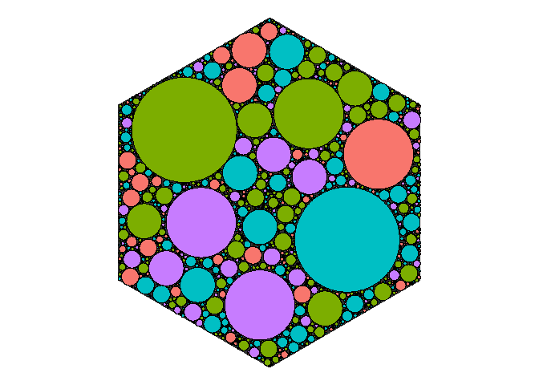

<!-- README.md is generated from README.Rmd. Please edit that file -->

# pack

<!-- badges: start -->
<!-- badges: end -->

The goal of pack is to …

## Installation

You can install the development version of pack like so:

``` r
# FILL THIS IN! HOW CAN PEOPLE INSTALL YOUR DEV PACKAGE?
```

## Example

``` r
library(pack)
library(ggplot2)
#> Warning: package 'ggplot2' was built under R version 4.2.2

circles <- pack_circles(draw::polygon(sides = 6, radius = 100), 
                        radii = make_radii(500, min = 2, max = 30), 
                        existing_circles = data.frame(x = 0, y = 0, r = 0))
#> made 500

ggplot(circles) +
  ggforce::geom_circle(aes(x0 = x, y0 = y, r = r)) +
  coord_fixed() +
  theme_void()
#> Warning: Using the `size` aesthetic in this geom was deprecated in ggplot2 3.4.0.
#> ℹ Please use `linewidth` in the `default_aes` field and elsewhere instead.
```


